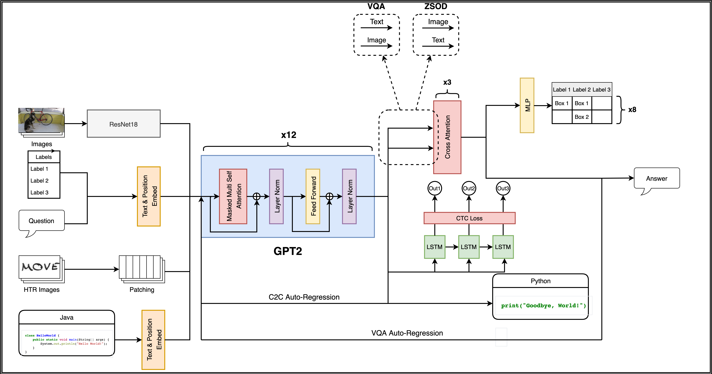

# Fusion Brain Challenge

The English version of the document can be found [here](https://github.com/sberbank-ai/fusion_brain_aij2021/blob/main/README_EN.md).

## Обновления

**27.10**:

* В раздел **Пример решения** добавлена ссылка на актуальный пример сабмита, а также ссылки на примеры входных/выходных данных.
* Уточнения по подзадаче **HTR**: по ссылке из раздела **Пример решения** можно скачать тестовый датасет, в котором содержатся собранные и размеченные нами изображения с текстом из школьных тетрадей (на русском и английском языках). Подчеркнем, что в test public, помимо стандартных, содержатся примеры с вертикальной ориентацией (повернутые на 90 градусов). Распределение данных в датасете рукописных тетрадей на английском языке отличается от распределения предлагаемого нами для обучения датасета **IAM**, поэтому советуем применять различные виды нормализации, аугментации – и учиться не только на **IAM**.
* В раздел **Данные** задачи VQA добавлена ссылка на набор данных, представляющий собой подвыборку VQA v2 (train), которая пересекается с обучающей выборкой Visual Genome, – это вопросы с ответами (на русском и английском языках) для 33,821 изображений.


## Общее описание задачи

В рамках данной задачи предлагается построить единую multitask-модель, которая бы успешно решала такие относящиеся к различным модальностям подзадачи, как **Code2code translation (С2С), Handwritten Text Recognition (HTR), Zero-shot object detection (zsOD), Visual Question Answering (VQA)** – и сумела бы превзойти минимальное значение интегральной метрики, установленное Организатором, а также минимальные значения метрик по каждой из подзадач.

Мы предоставляем [концепт единой модели](https://colab.research.google.com/drive/1YAkxWG0dRKPtqy9CZxFPvCNCCXvMGr65?usp=sharing%22%20target%3D%22_parent%22%3E%3Cimg%20src%3D%22https%3A%2F%2Fcolab.research.google.com%2Fassets%2Fcolab-badge.svg%22%20alt%3D%22Open%20In%20Colab), которая обучается на нескольких задачах, относящихся к различным модальностям (визуальной, аудио и текстовой). Концепт вдохновлен статьёй ["Pretrained Transformers as Universal Computations Engines"](https://arxiv.org/pdf/2103.05247.pdf) (```Lu et al., 2021```), в которой исследуется способность предобученных языковых моделей на базе архитектуры Трансформер формировать качественные репрезентации для произвольных последовательностей данных – обобщаться, таким образом, на другие модальности с минимальным дообучением. Основа предлагаемой в концепте архитектуры – предобученная языковая модель GPT-2; эксперименты проводятся как с "замороженной" моделью (Frozen Pretrained Transformer), так и с моделью, все слои которой дообучаются на трёх модальностях одновременно.

**Также рекомендуем ознакомиться с [обзором мультизадачных и мультимодальных архитектур](https://github.com/sberbank-ai/fusion_brain_aij2021/blob/main/Papers%20on%20multitask%20%26%20multimodal%20models.md).**

Для того чтобы представленная командой/участником архитектура считалась единой (multitask-модель), необходимо и достаточно выполнения следующих требований:

1) общие параметры (shared weights) должны составлять **не менее 30%** всех параметров модели: *если  - суммарное число параметров моделей, решающих **4** подзадачи, а  - число общих параметров этих моделей (то есть одинаковых и по значению, и архитектурно), тогда необходимо, чтобы *

2) общие параметры не должны иметь исключительно номинальный характер — напротив, должны **значимым образом** использоваться во время совершения предсказания моделью и **положительно** влиять на качество её работы. 

При невыполнении хотя бы одного из требований выше модель считается решающей подзадачу (или подзадачи) по отдельности.

Загрузка решений станет доступна с **07.10.2021**.


## Общий формат решения

### Содержимое контейнера

В проверяющую систему необходимо отправить код алгоритма, запакованный в ZIP-архив. Решения запускаются в изолированном окружении при помощи Docker. Время и ресурсы во время тестирования ограничены. Участнику нет необходимости разбираться с технологией Docker.

В корне архива обязательно должен быть файл ```metadata.json``` следующего содержания:
```
{
    "image": "cr.msk.sbercloud.ru/aijcontest2021/fusion:0.0.1",
    "entrypoint": "python /home/jovyan/run.py"
}
```

Здесь ```image``` – поле с названием docker-образа, в котором будет запускаться решение, ```entrypoint``` – команда, при помощи которой запускается скрипт инференса. Для решения текущей директорией будет являться `/home/jovyan`.

Для запуска решений можно использовать существующее окружение:

* ```cr.msk.sbercloud.ru/aijcontest2021/fusion:0.0.1``` - [Dockerfile и requirements](https://drive.google.com/file/d/1JGv-khEGv8tFD6wAiLJIP6qocd0CUZIJ/view?usp=sharing) для данного image.

При необходимости вы можете подготовить свой образ, добавив в него необходимое ПО и библиотеки (см. [инструкцию по созданию docker-образов](https://github.com/sberbank-ai/no_fire_with_ai_aij2021/blob/main/sbercloud_instruction.md)); для использования его необходимо будет опубликовать на ```sbercloud```. Кастомные образы должны быть наследованы от базовых образов ```sbercloud``` (см. [базовые образы](https://docs.sbercloud.ru/aicloud/mlspace/concepts/environments__basic-images-for-training.html)). При создании кастомного образа необходимо присвоить ему индивидуальное название и тэг (например, ```my_custom_fusionchallenge:0.0.5```).

### Структура данных

В контейнер помещается папка `input`. Названия вложенных в `input` подпапок соответствуют названиям подзадач, которые необходимо решить единой модели. Внутри каждой из подпапок (C2C, HTR, zsOD, VQA) лежит контент, необходимый для совершения предсказаний.

Структура данных выглядит следующим образом:

* input
  * C2C 
    * requests.json
  * HTR
    * images 
  * zsOD
    * images
    * requests.json
  * VQA
    * images
    * questions.json

Единая модель должна сформировать предсказания формата ```prediction_{TASK_NAME}.json``` для каждой из подзадач, то есть после инференса модели должно получиться 4 файла: ```prediction_C2C.json, prediction_HTR.json, prediction_zsOD.json, prediction_VQA.json```. Эти файлы должны располагаться в папке `output` (полный путь: `/home/jovyan/output`).

Структура директории с предсказаниями модели должна быть следующей:

* output
  * prediction_C2C.json
  * prediction_HTR.json
  * prediction_zsOD.json
  * prediction_VQA.json

После этого в контейнер подкладываются правильные ответы формата ```true_{TASK_NAME}.json``` и запускается скрипт подсчета метрик для каждой из подзадач. Финальная метрика считается как сумма метрик для каждой из подзадач (об этом ниже).

### Бейзлайн

В папке `fb_baseline` находится базовое решение по всем четырем подзадачам. Это решение основано на концепте мультимодальной модели из `fb_concept`. В ноутбуке `fb_baseline/FBC_baseline.ipynb` находится код с формированием датасета, архитектурой модели и логикой обучения. В папке `fb_baseline/fb_utils` - вспомогательный набор скриптов.

* `BLEU.py` и `c2c_eval.py` - скрипты, в которых содержатся вспомогательные функции для инференса и расчета метрики в задаче C2C
* `detection_vqa.py` - скрипт, в который вынесены функции потерь, слои feedforward и cross-attention, а также вспомогательные функции для задач zsOD и VQA
* `download.py` - скрипт загрузки файлов для обучения
* `handwritten.py` - скрипт с вспомогательными функциями для задачи HTR
* `metrics.py` - подсчет метрик всех 4-х подзадач.

На следующем рисунке представлена схема предлагаемой архитектуры:

<p align="center">
  
</p>

По этой [ссылке](https://www.youtube.com/watch?v=cNEsBWXmJqY&t=5982s) можно посмотреть запись вебинара с подробным разбором бейзлайна.

### Пример решения

По [ссылке](https://dsworks.s3pd01.sbercloud.ru/aij2021/baseline/sberai_baseline_ooc.zip) находится архив `sberai_baseline_ooc.zip`, в котором содержится пример загружаемого решения. Метрику качества данного решения можно найти в лидерборде соревнования по названию команды `sberaiooc`. Следующие файлы в загружаемом архиве необходимы для формирования предсказаний модели:

 * `metadata.json` - обязательный файл для каждого решения; в нём должны быть указаны пути к образу и скрипту выполнения модели
 * `run.py` - основной скрипт для инференса модели
 * `last.pt` - веса модели, которые подгружаются во время исполнения скрипта `run.py`
 * `utils` - папка с вспомогательными скриптами для `run.py`. В случае бейзлайна содержит два файла:
     * `dataset.py` - в скрипт вынесен код для формирования класса DatasetRetriever и функция fb_collate_fn
     * `fb_model.py` - в скрипт вынесен весь код для создания класса модели
 * `gpt_init` - папка с необходимыми файлами для инициализации `GPT2Tokenizer` и `GPT2Model`
 * `fb_utils` - вспомогательный набор скриптов; повторяет, за некоторыми исключениями, аналогичную папку из `fb_baseline` в данном репозитории.

Примеры данных (советуем обратить внимание на `input/HTR/images`: дополнительно к русскому языку там содержатся примеры на английском):

* [input](https://dsworks.s3pd01.sbercloud.ru/aij2021/sample_data/input.zip) - примеры входных данных для каждого из заданий;
* [output](https://dsworks.s3pd01.sbercloud.ru/aij2021/sample_data/output.zip) - примеры предсказаний модели для файлов из папки `input`; это случайные предсказания, и они указывают только на верный формат, который ожидается от модели участников;
* [true](https://dsworks.s3pd01.sbercloud.ru/aij2021/sample_data/true.zip) - примеры файлов с верными ответами для каждой задачи, с ними сравниваются предсказания из папки `output` во время подсчета метрики. 

## Ограничения

В течение одних суток Участник или Команда Участников может загрузить для оценки не более 3 (трёх) решений. Учитываются только валидные попытки, получившие численную оценку.

Контейнер с решением запускается в следующих условиях:
* 100 Гб оперативной памяти
* 3 vCPU
* 1 GPU Tesla V100 (32 Гб)
* время на выполнение решения: 30 минут
* решение не имеет доступа к ресурсам интернета
* максимальный размер упакованного и распакованного архива с решением: 10 Гб
* максимальный размер используемого Docker-образа: 15 Гб.

Мы предоставляем участникам возможность получить доступ к вычислительным ресурсам Кристофари для обучения модели. Количество ресурсов ограничено. Для получения доступа необходимо отправить заявку на адрес `Christofari_AIJContest_2021@sberbank.ru` с описанием того, как именно планируется использовать вычислительные ресурсы.  

## Метрика качества

С метрикой качества для каждой из подзадач можно ознакомиться по [ссылке](https://github.com/sberbank-ai/fusion_brain_aij2021/blob/main/Metrics.md).

# Подзадача 1 - Code2code Translation

## Описание 
Задача перевода с одного языка программирования на другой, стандартно входит в обширный репертуар сферы ML4Code. На данный момент существует несколько различных вариантов решения – как в духе контролируемого обучения, при котором в качестве обучающего датасета используется параллельный корпус (базовая модель бенчмарка [CodeXGLUE](https://arxiv.org/pdf/2102.04664.pdf) c CodeBERT в качестве кодировщика в архитектуре типа «кодировщик-декодировщик», ```Lu et al., 2021``` ), так и неконтролируемого, включающего предобучение кросс-лингвальной языковой модели на монолингвальных корпусах ([TransCoder](https://arxiv.org/pdf/2006.03511.pdf), ```Lachaux et al., 2020```). 

Особую сложность представляет случай, когда язык-источник и целевой язык имеют различную типизацию. Наша задача относится именно к такому варианту: необходимо выполнить перевод с языка, имеющего статическую типизацию (Java), на язык с динамической типизацией (Python). На вход модели подаётся функция, написанная на языке Java, – модель должна выдать аналогичную функцию на языке Python. 

## Данные

**Train.** В качестве обучающего датасета предлагается использовать train (5,937 программистских задач) и val (845) части параллельного корпуса [AVATAR](https://github.com/wasiahmad/AVATAR), состоящего из пар аналогичных функций/программ, одна из которых написана на языке программирования Java, другая — на Python. В связи с тем, что в датасете содержится от 1 до 5 вариантов решения задач на обоих языках программирования, можно сформировать от 1 до 25 параллельных примеров на каждую задачу. Авторы датасета предлагают выбирать для каждого языка максимум 3 решения — таким образом, на одну проблему приходится максимум 9 обучающих примеров. Мы предлагаем использовать [датасет](https://dsworks.s3pd01.sbercloud.ru/aij2021/%D0%A12%D0%A1_translation/CodeToCodeTranslation_train_java_python.jsonl), который сформирован именно таким способом. 

Файл имеет формат jsonl с полями "java" и "python":

```
{"java":"import java . util . Scanner ; \u00a0 public class A1437 { \u00a0 public static void main ( String [ ] args ) { Scanner in = new Scanner ( System . in ) ; int T = in . nextInt ( ) ; for ( int t = 0 ; t < T ; t ++ ) { int L = in . nextInt ( ) ; int R = in . nextInt ( ) ; boolean possible = R < 2 * L ; System . out . println ( possible ? \" YES \" : \" NO \" ) ; } } \u00a0 }\n","python":"t = int ( input ( ) ) NEW_LINE ans = [ ] NEW_LINE for i in range ( t ) : l , r = [ int ( x ) for x in input ( ) . split ( ) ] NEW_LINE if ( 2 * l ) > r : NEW_LINE INDENT ans . append ( \" YES \" ) else : NEW_LINE ans . append ( \" NO \" ) NEW_LINE DEDENT for j in ans : print ( j ) NEW_LINE\n"}
```

Для создания обучающего параллельного корпуса также можно использовать [CodeNet](https://github.com/IBM/Project_CodeNet), в котором содержатся решения 4,000 программистских задач на С++, С, Python и Java, извлеченных с сайтов AtCoder (в датасете AVATAR используются решения с этого ресурса по части задач) и AIZU Online Judge. Для удобства участников мы предоставляем [архив](https://dsworks.s3pd01.sbercloud.ru/aij2021/%D0%A12%D0%A1_translation/CodeNet_accepted_java_python.tar.gz) (полные данные содержатся в репозитории https://developer.ibm.com/technologies/artificial-intelligence/data/project-codenet/), в котором содержатся решения с CodeNet на языках Java и Python, разбитые по задачам. Стоит, однако, учитывать, что решения одной программистской задачи на разных языках являются, как минимум, клонами 4 типа (сохранение семантики кода при широкой вариативности синтаксиса), но не являются гарантированно идентичными друг другу с поправкой на различия в языках (буквальным переводом).   

**Test public.** Публичный лидерборд формируется по результатам проверки предсказаний моделей на тестовой выборке (1,699 примеров) датасета AVATAR.

**Test private.** Приватный тестовый датасет скрыт от участников. Его формат аналогичен публичной тестовой выборке. 

## Формат решения

Данные для совершения предсказания, относящегося к данной подзадаче, включают:

* Файл ```requests.json```. Это словарь формата ```{ "0": "import java . util . Scanner ; ..." ,  ... }```. Ключами являются индексы примеров, значениями – строки функций/программ на языке Java, которые необходимо перевести на язык программирования Python. 

Модель участника должна перевести все примеры из файла requests.json и сгенерировать файл ```prediction_С2С.json```. Это словарь формата ```{ "0": "def find ( x , par ) : NEW_LINE INDENT if par [ x ] == x : ..." ,  ... }```. Ключами являются индексы примеров, значениями – переводы функций/программ на язык Python. Обратите внимание, что, поскольку в Python используются отступы для идентификации логических блоков в коде, в строке перевода на Python присутствуют специальные токены ```INDENT```, ```DEDENT```. 

После проведения инференса скрипт подсчета метрик сравнивает файлы ```prediction_С2С.json``` и ```true_С2С.json```, а затем выводит финальное значение метрики CodeBLEU.

# Подзадача 2 - Handwritten Text Recognition

## Описание 

Перед участниками ставится задача распознавания рукописного текста на изображении. На вход модели подается изображение с рукописным текстом на русском или английском языках. Модель должна выдать в качестве ответа текстовую строку, соответствующую контенту изображения, - в данном случае строку «последовал»:


## Данные

**Train.** Для обучения предоставляется [набор данных](https://dsworks.s3pd01.sbercloud.ru/aij2021/htr/train.zip), состоящий из собранных вручную и обработанных нами школьных тетрадей. Изображения в нем являются отдельными словами на русском языке в тексте, написанном на странице тетради. Что касается рукописных слов на английском языке, мы рекомендуем использовать известный датасет [IAM](https://fki.tic.heia-fr.ch/databases/iam-handwriting-database).

**Test public.** Публичный лидерборд рассчитывается на датасете тетрадей, содержащих русские и английские рукописные слова (14,973 примера).

**Test private.** Приватный тестовый датасет скрыт от участников. Это тоже набор данных для распознавания текста, в похожем на обучающий датасет формате.

## Формат решения

Данные для совершения предсказания, относящегося к данной подзадаче, включают:

* Папка ```images```. Это набор изображений, по которым нужно сделать предсказания. Внутри лежат файлы формата ```0.png, 1.png ...```. Каждый файл содержит графические изображения символов, которые необходимо перевести в текстовые символы (текстовые строки). 

Модель участника должна сделать предсказания на всех изображениях из папки images, и сгенерировать файл ```prediction_HTR.json```. Это словарь формата ```{"0.png": "<предсказанный текст на изображении>" ,  "1.png": "<предсказанный текст на изображении>" , ... }```. Ключами являются соответствующие названия файлов из папки images, значениями — предсказанные строки на соответствующих изображениях. Если по каким-то причинам на файле с изображением name.png не было сделано предсказания, то есть в ключах словаря ```prediction_HTR.json``` отсутствует ключ ```"name.png"```, то перевод заполняется пустой строкой ```""```.

После проведения инференса скрипт подсчета метрик сравнивает файлы ```prediction_HTR.json``` и ```true_HTR.json```, а затем выводит финальное значение метрики по данной задаче.

Файл ```true_HTR.json``` имеет формат ```{ "0.png": "<правильный текст на изображении>" ,  "1.png": "<правильный текст на изображении>" , ... }```. Ключами являются соответствующие названия файлов из папки images, значениями — правильный перевод строки на соответствующем изображении. 

# Подзадача 3 - Zero-shot Object Detection

## Описание 

* Необходимо определить верное описание объекта, изображенного на фотографии (или объектов, если их несколько). Например, на фотографии могут оказаться такие сущности/объекты, описанные на естественном языке как "зеленое яблоко, лежащее на земле", "мужчина, перепрыгивающий через гидрант", "женщина в шортах".

* Одновременно с этим нужно определить местоположение и масштаб каждого из объектов на фотографии. Местоположение объекта описывается так называемым bounding box (ограничивающая рамка, bbox). Это прямоугольник, который наиболее аккуратно нарисован вокруг рассматриваемого объекта. Положение прямоугольника задается 4-мя числами – X, Y, W, H:

  * X – горизонтальная координата верхнего левого угла
  * Y – вертикальная координата верхнего левого угла
  * W – ширина прямоугольника
  * H – высота прямоугольника

Предсказаниями модели должны быть координаты bbox и класс, представляющий собой описание на естественном языке, для каждого объекта на фотографии. Пример результата работы модели object detection представлен на следующем изображении: 


В рамках нашего соревнования задача сформулирована как zero-shot object detection. Zero-shot в описании задачи означает, что модели нужно сделать предсказание на данных, совершенно отличных от обучающего набора. Стандартная модель object detection во время предсказания должна выдавать один класс из ограниченного набора, четко заданного во время обучения модели. Zero-shot модель должна уметь детектировать классы, которые не встречались в обучающей выборке.

Еще одна особенность предлагаемой задачи заключается в том, что множество классов для каждого изображения передается в формате запроса. Запрос может содержать описания как на русском, так и на английском языках.

Во время стадии предсказания на вход модели подаются две сущности: первая – изображение, вторая – запрос на естественном языке. Формат запроса – список текстовых строк, которые представляют собой описания на естественном языке – классы, среди которых нужно произвести поиск. Пример: ```«красное яблоко, висящее на ветке», «лысый человек», «девочка, кормящая слона»```. Запрос содержит и верные описания, которые относятся к объектам, действительно присутствующим на изображении, – и некоторое количество неправильных описаний. Их объединение является общим пространством поиска для модели. Результатом предсказания модели должен стать список предсказанных классов вместе с соответствующими координатами bounding box.

## Данные

**Train.** Для обучения предлагается использовать популярный датасет [MS-COCO](https://cocodataset.org/#download), содержащий изображения (файл *2017 Train images*) и соответствующие им аннотации (файл *2017 Train/Val annotations*).

Также стоит использовать датасет [VisualGenome](https://visualgenome.org/api/v0/api_home.html), за исключением [изображений](https://dsworks.s3pd01.sbercloud.ru/aij2021/zsOD/images_ids_Visual_Genome_to_exclude.json), которые включены в выборку публичного тестового датасета (чтобы результаты публичного лидерборда были показательны для участников).

Мы также предоставляем набор данных, представляющий собой подвыборку VisualGenome (train), которая пересекается с обучающей выборкой VQA v2, – это region descriptions (в среднем 10 описаний на 1 изображение) с соответствующими ограничивающими рамками для 33,821 изображений; половина семплов дана [на английском языке](https://dsworks.s3pd01.sbercloud.ru/aij2021/zsOD/vg_intersection_eng.json), другая половина – [на русском языке](https://dsworks.s3pd01.sbercloud.ru/aij2021/zsOD/vg_intersection_rus.json) (машинный перевод). 

**Test public.** Публичный тестовый датасет сформирован из части датасета VisualGenome (1,000 примеров); набор классов в нем скрыт от участников. В качестве позитивных классов используются region descriptions (описания подвергаются нормализации: приведению к нижнему регистру, удалению непечатаемых символов и т.п.; объединяются под единым описанием боксы, относящиеся к одной сущности) из VisualGenome; негативные классы формируются заменой некоторых объектов/атрибутов в описании на те, которые отсутствуют на фото: например, `the chair is grey` заменяется на `the chair is pink`, `cushion on the end of the sofa` – на `cushion on the end of the table`; также в качестве негативных примеров используются описания объектов, относящиеся к тому же домену, что и верные классы: если на фото изображена улица, то в качестве негативных примеров могут присутствовать, например, такие описания, как `tall green bricks wall`, `shingled home in distance`, `food stand in the street` (при условии, конечно, что описанные объекты отсутствуют на фотографии). 

**Test private.** Приватный тестовый датасет скрыт от участников, так же как и набор классов в нем.

## Формат решения

Данные для совершения предсказания, относящегося к данной подзадаче, включают:

* Папка ```images```. Это набор изображений, по которым нужно сделать предсказания. Внутри лежат файлы формата ```0.jpg, 1.jpg ...```.
* Файл ```requests.json```. Это словарь формата ```{ "0.jpg": ["красное яблоко, висящее на ветке", "лысый человек", "девочка, кормящая слона"] ,  ... }```. Ключами являются соответствующие названия файлов из папки images, значениями – список классов, которые нужно детектировать на соответствующем изображении (запрос). Как говорилось ранее, список классов может быть как на русском, так и на английском языке. Запрос, таким образом, представляет собой список классов (описаний на естественном языке), среди которых нужно произвести поиск. **Список классов содержит и правильные описания, относящиеся к объектам, которые действительно находятся на изображении, и некоторое количество неправильных описаний (соответствующих объектов нет на изображении).**

Модель участника должна сделать предсказания на всех изображениях из папки images, и сгенерировать файл ```prediction_zsOD.json```. Это словарь формата ```{"0.jpg": {"красное яблоко, висящее на ветке": [[473.07, 395.93, 38.65, 28.67]], "лысый человек": [], "девочка, кормящая слона": [[0.0, 101.15, 452.3, 319.43], [10.0, 123.0, 15.0, 22.0]]}, ... }```. Ключи – названия файлов с изображениями из папки `images`, значения – словари, ключи в которых являются названиями классов, предложенных в `requests.json` для поиска на соответствующем изображении, а значения, в свою очередь, – предсказания модели для соответствующего класса на данном изображении. Предсказания для каждого класса внутри каждого изображения должны содержать координаты ограничивающих рамок: по ключу "название файла с изображением" – вложенный словарь классов. Внутри каждого такого словаря по ключу названия класса — вложенный список формата ```[[xmin, ymin, w, h]]```. Формат одного элемента в списке: ```[473.07, 395.93, 38.65, 28.67]``` (четыре элемента, разделенных запятыми) – координаты bbox в формате ```xywh```. Во вложенном списке может содержаться неограниченное количество элементов – это все боксы, которые предсказала модель для данного класса на данном изображении.

Словарь правильных ответов ```true_OD.json```, который будет использоваться для оценки качества модели во время запуска в контейнере, имеет следующий формат: ```{img_name: {class_name1: [[xmin, ymin, w, h]], class_name2 :[], class_name3 : [[xmin, ymin, w, h], [xmin, ymin, w, h]]}, ...}```. Если по ключу класса находится пустой список, это значит, что данный класс в запросе из ```requests.json``` является негативным, то есть описанный объект отсутствует на изображении. Модель так же не должна ничего предсказывать для данного лейбла, то есть должен быть передан пустой список ```[]```. 

Далее система сравнивает файл с предсказаниями с файлом ```true_zsOD.json```, содержащим правильные ответы, и выводит итоговую метрику F1-score.

# Подзадача 4 - Visual Question Answering

## Описание 

Необходимо ответить текстом на вопрос по представленному изображению. На вход модели подаются изображение и текстовый вопрос, связанный с этим изображением, - на выходе модель должна выдать ответ на заданный вопрос в виде текста. Например, ответом на вопрос "Из чего сделаны усы?" в данном случае может быть слово "бананы":


Особенность задачи заключается в том, что вопросы не гомогенны: подходящий ответ может как состоять из нескольких слов, так и быть односложным (ответ типа "да/нет") или представлять собой число. Подразумевается, что на один вопрос необходимо дать только один ответ. 

Вопросы могут быть как на английском языке, так и на русском. Предполагается, что язык ответа соответствует языку вопроса, кроме тех случаев, когда вопрос касается текста на изображении (например, "Что написано на футболке?") – в этом случае ответ должен быть на том же языке, на котором написан текст. 

## Данные

**Train.** В качестве обучающей выборки предлагается использовать часть train датасета [VQA v2](https://visualqa.org/download.html): в состав входят вопросы на английском языке (файл *Training questions 2017 v2.0*), изображения из датасета COCO, по которым эти вопросы заданы (файл *Training images*), а также аннотации — ответы на вопросы (файл *Training annotations 2017 v2.0*).

Мы также предоставляем набор данных, представляющий собой подвыборку VQA v2 (train), которая пересекается с обучающей выборкой Visual Genome, – это вопросы с ответами для 33,821 изображений; для половины изображений вопросы даны [на английском языке](https://dsworks.s3pd01.sbercloud.ru/aij2021/VQA/VQA_eng.zip) (90,359 вопросов), для другой половины – [на русском языке](https://dsworks.s3pd01.sbercloud.ru/aij2021/VQA/VQA_rus.zip) (88,761 вопрос, машинный перевод). 

**Test public.** Публичный тестовый датасет состоит из вопросов как на русском, так и на английском языках: русскоязычная часть представляет собой переведённые примеры из первых 10 тыс. семплов валидационной части датасета VQA v2, английская — примеры из вторых 10 тыс. того же датасета, взятых в оригинальном виде. Общий размер выбоки – 5,446 примеров.

**Test private.** Приватный тестовый датасет скрыт от участников. Его формат аналогичен публичной тестовой выборке, в нем присутствуют вопросы на русском и английском языках.

## Формат решения

Данные для совершения предсказания, относящегося к данной подзадаче, включают:

* Папка ```images```. Это набор изображений, к которым относятся вопросы. Внутри лежат файлы формата ```0.jpg, 1.jpg ...```.
* Файл ```questions.json```. Это словарь формата ```{ "0": {"file_name": "1.jpg", "question": "Куда он смотрит?"} ,  ... }```. Ключами являются индексы примеров, значениями – словарь с полями "file_name" (значение – название файла из папки images) и "question" (значение – текст вопроса по соответствующему изображению). Вопросы могут быть заданы как на английском языке, так и на русском. 

Модель участника должна сделать предсказания по всем вопросам и сгенерировать файл ```prediction_VQA.json```. Это словарь формата ```{ "0": "вниз" ,  ... }```. Ключами являются индексы примеров, значениями – предсказанные моделью ответы на соответствующие вопросы. 

После проведения инференса скрипт подсчета метрик сравнивает файлы ```prediction_VQA.json``` и ```true_VQA.json```, а затем выводит финальное значение метрики Accuracy. 

# Интегральная метрика

Итоговая оценка multitask-модели складывается из оценок по подзадачам:


где S – итоговая оценка участника, S<sub>1</sub> – оценка по подзадаче Code2code Translation, S<sub>2</sub> – оценка по подзадаче Handwritten Text Recognition, S<sub>3</sub> – оценка по подзадаче Zero-shot Object Detection, S<sub>4</sub> – оценка по подзадаче Visual Question Answering. 

Оценка по каждой из подзадач принимает значения от 0 до 1 (исключение составляет метрика CodeBLEU, которая используется для оценки Code2code Translation и может принимать значения в диапазоне от 0 до 100 – с целью нормализации метрика умножается на коэффициент 0.01) – таким образом, минимальное значение итоговой оценки составляет 0, максимальное – 4. Расчет оценки по каждой подзадаче округляется до третьего знака после запятой. По значениям итоговой оценки формируется лидерборд по задаче Fusion Brain Challenge. 

# Призовой фонд

Размер возможного выигрыша зависит от того, является ли предложенная архитектура единой multitask-моделью (в которой доля общих параметров, используемых для решения всех подзадач, составляет не менее 30% от всех параметров) или unitask-моделью (решающей одну подзадачу). 

В случае multitask-модели, для каждого призового места есть фиксированная сумма выигрыша (FIX). Размер бонуса зависит от итоговой оценки призеров, но не может превышать разницы между максимальным значением (MAX) и фиксированным. Необходимо превзойти минимальные значения метрик, установленные для каждой подзадачи, — и, следовательно, минимальное значение интегральной метрики.

Минимальные оценки, установленные по каждой из подзадач, имеют следующие значения:


Минимальное значение интегральной оценки S<sub>min</sub> рассчитывается таким образом:


Формула расчета денежного приза имеет следующий вид:


где S – итоговая оценка участника, S<sub>min</sub> = 1.3 – минимальное значение итоговой оценки, коэффициент α зависит от места в лидерборде (топ-3 решения) и вычисляется следующим образом:


где α<sub>place</sub> – коэффициент для расчета бонуса для первого, второго и третьего мест в лидерборде (α<sub>1</sub> = 2, α<sub>2</sub> = 1, α<sub>3</sub> = 0.6) при S<sub>min</sub> ≤ S < 2.3. MAX<sub>place</sub> – максимальный размер вознаграждения для топ3-решений в лидерборде при S ≥ 2.3 (MAX<sub>1</sub> = 3 млн руб., MAX<sub>2</sub> = 1.5 млн руб., MAX<sub>3</sub> = 0.8 млн руб.). FIX<sub>place</sub> – фиксированная сумма выигрыша для топ-решений в лидерборде при S<sub>min</sub> ≤ S < 2.3 (FIX<sub>1</sub> = 1 млн руб., FIX<sub>2</sub> = 0.5 млн руб., FIX<sub>3</sub> = 0.2 млн руб.).


**Номинации, относящиеся к созданию multitask-модели**: 

**Первое место:** от 1 000 000 рублей до 3 000 000 рублей (в зависимости от качества представленного участником решения)
**Второе место:** от 500 000 рублей до 1 500 000 рублей (в зависимости от качества представленного участником решения)
**Третье место:** от 200 000 рублей до 800 000 рублей (в зависимости от качества представленного участником решения)

**Дополнительные номинации:** 

Организатором будут оцениваться лучшие решения по каждой из подзадач, за которые участник/команда участников, показавшая лучший результат, сможет также получить Приз, независимо от того, является ли представленная модель multitask (решающей все подзадачи единой архитектурой) или unitask (решающей одну подзадачу). По каждой из подзадач лучшее решение будет выбрано на основе лидерборда по этим подзадачам; представленная модель должна превосходить минимальное значение метрики по соответствующей подзадаче (минимальные значения описаны выше).

* 300 000 рублей за первое место в подзадаче Code2code Translation
* 300 000 рублей за первое место в подзадаче Handwritten Text Recognition
* 300 000 рублей за первое место в подзадаче Zero-shot Object Detection
* 300 000 рублей за первое место в подзадаче Visual Question Answering

[Правила проведения Конкурса "Artificial Intelligence Journey Contest"](https://api.dsworks.ru/dsworks-transfer/api/v1/public/file/rules.pdf/download)  
[Пользовательское соглашение](https://api.dsworks.ru/dsworks-transfer/api/v1/public/file/terms_of_use.pdf/download)
